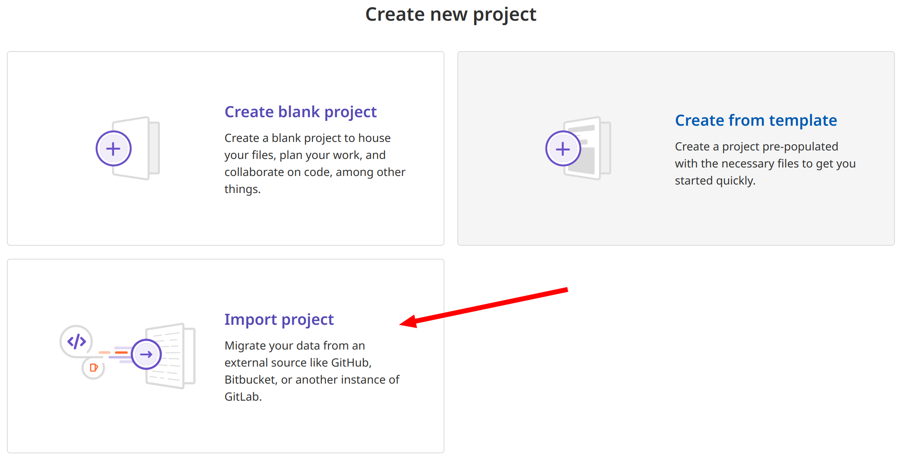
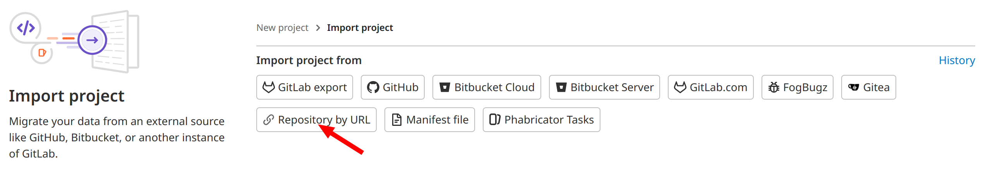
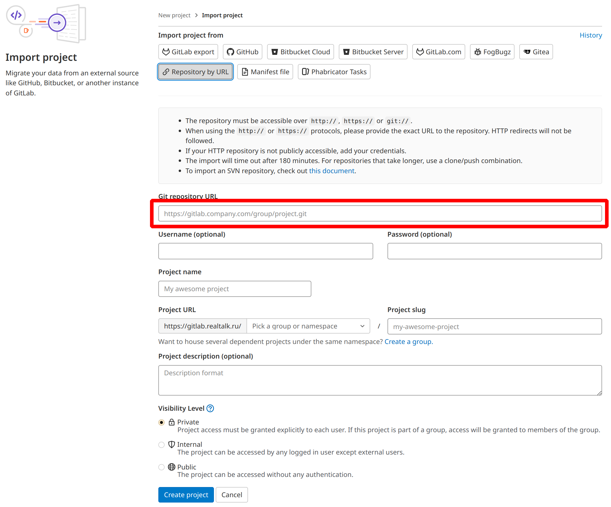

# Python Template

Template project for new python projects

## Getting started

If you're still not agreed on base development template, suggest to use this one:

## Gitlab

- Log in to you account
- Press button to create a new project
- Choose `import project`: 
- Choose `Repository by URL`: 
- Enter https://github.com/vvpreo/python-template.git here: 
- Fill your project's name and description.
- Press `Create project`

### Basic principals

##### Repository organization
- Default branch's name is `dev`. So everything you develop by dafault is about to be checked on dev stand.
- If you are adding a **f**eature, call branch `f/<feature_name__or__task_id>`
- If you are fixing a **b**ug, call branch `b/<bug_name__or__task_id>`
- If you are **r**efactoring, call branch `r/<goal_name__or__task_id>`

#### Toolset
- Using python 3.9+
- Using pytest
- Using poetry
- Using virtual environment in `<project_root>/venv` folder.

#### Folders structure
Feel free to delete folders you are not usign in your project.
- `src` is where ALL your *.py files located. add packages if necessary.
- `tst` is where ALL your tests are located. automated and manual.
- `envs` is where ALL *.env files located
- `scripts` is where ALL *.sh/*.bat etc... files located
- `runtime` is a place where you write your logs and other stuff generated by you application. It is not intendend to be saved for further usaage.
- `docs` is where ALL your documentation located. Recommended to use [PUML](https://crashedmind.github.io/PlantUMLHitchhikersGuide/index.html) + [c4 model](https://c4model.com/)
- `migrations` is where ALL your migration scripts reside.

#### Common files
- `.gitignore`. Listed directories and files not for version control.
- `.gitlab-ci.yml`. Gitlab's CI/CD description.
- `Dockerfile`. Steps for building your docker image. For Development and to be deployed.
- `docker-compose`. Basic compose that you may use for DEVELOPMENT purposes. Use different files for deployment.

#### Development
- All scripts, and other commands must be ran from project's root directory.
- It is recommended to add 5 to service ports for avoid conflicts with services running on their default ports. Default postgres port is 5432. If you want to use the same instance for OS and docker development, simpy map hosts **5**5432 on container's 5432.
- It is recomended to use snake case naming for *.py files and python packages.
- It is recommended to use common library for basic functions (logging, args/envs reading, etc...).
- It is recommended to use your own base image for Dockerfile if exists.

#### CI/CD Recomendations
- When pushing to `dev`, new version should be automatically deployed to appropriate stand for vevelopment purposes
- When pushing to branch or adding tag with names one of below:
  - `tst` - TEST.
  - `uat` - UAT (User Acceptance Testing).
  - `cnd` - Release Candidate.
  - `prd` - Production.

  It is recommended to automate deployment to appropriate stand.
- It is recommended to automate CI for every new push to `dev`
- It is recommended to add test stage to `dev` pipeline configuration.